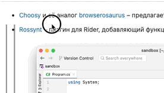
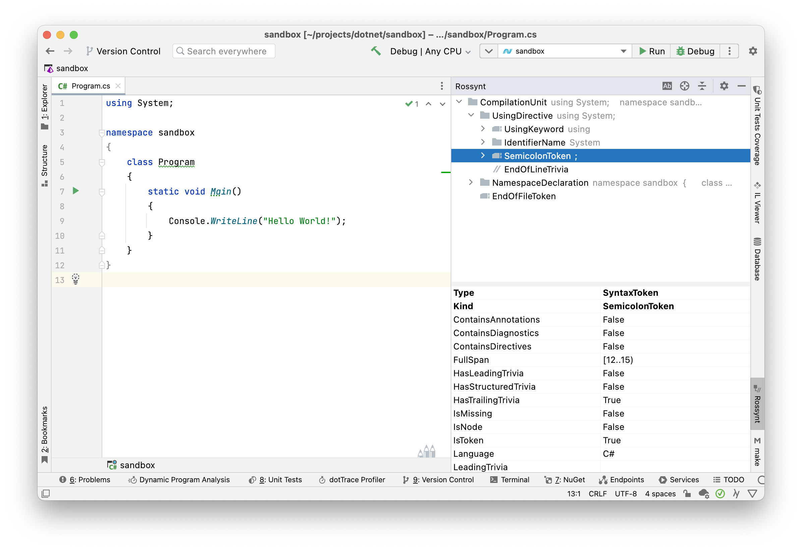

# Список ПО

- [Choosy](https://choosy.app/) и её аналог [browserosaurus](https://github.com/will-stone/browserosaurus) – предлагает выбрать, в каком браузере открывать ссылку

- [Divvy](https://mizage.com/divvy/) – менеджер окон (и альтернатива [moom](https://manytricks.com/moom/))

- [Rossynt](https://plugins.jetbrains.com/plugin/16902-rossynt) – плагин для Rider, добавляющий функциональность, аналогичную Visual Studio Syntax Visualizer

 
- [Keka](https://www.keka.io/en/) – архиватор. С его помощью я просматриваю .nupkg локально и извлекаю из них .dll-ки

  upd: круто, конечно, но перешёл на `unzip <name>.nupkg -d ...`

- [zpm-zsh/clipboard](https://github.com/zpm-zsh/clipboard) – работа с буфером обмена из консоли

- [HexFiend](https://github.com/HexFiend/HexFiend) – можно сравнивать бинарные файлы в hex-виде