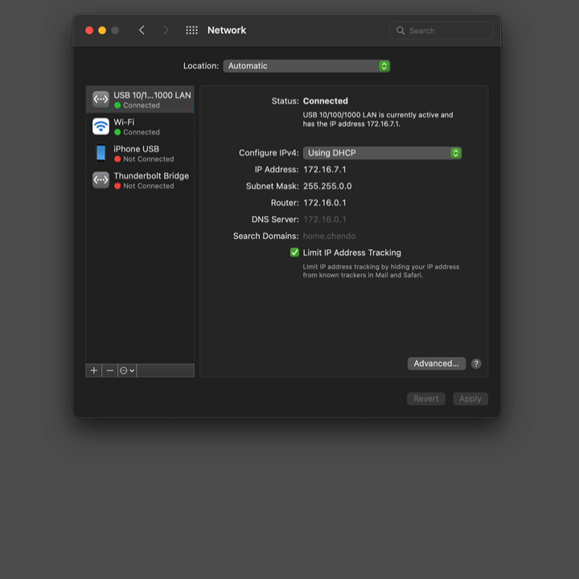

# Список ПО

- [Choosy](https://choosy.app/) и её аналог [browserosaurus](https://github.com/will-stone/browserosaurus) – предлагает выбрать, в каком браузере открывать ссылку

- [Divvy](https://mizage.com/divvy/) – менеджер окон (и альтернатива [moom](https://manytricks.com/moom/))

  - Ещё есть [veeer](https://veeer.io/), но требует email и просит «справедливую» цену (можно указать $0)

  - фаворит – [ShiftIt](https://github.com/fikovnik/ShiftIt), а вернее его [реинкарнация](https://github.com/fikovnik/ShiftIt/wiki/The-Hammerspoon-Alternative) на основе Hammerspoon ([запилил](https://github.com/askazakov/hammerspoon-shiftit/commit/f47a772691f2df9c0195f42c73e558687edb7475) кастомное расположение окна)

  - [rectangle](https://rectangleapp.com/) + [github](https://github.com/rxhanson/Rectangle) – клёвая утилита с прикольными хоткеями по-умолчанию, но особых преимуществ перед настроенным решением на Hammerspoon нет

- [warpd](https://github.com/rvaiya/warpd) – A modal keyboard-driven virtual pointer.

  Три режима. Самый полезный:

  

  - Есть три интересных программы – [Shortcat](https://shortcat.app/),
[Homerow](https://www.homerow.app/) и [Vimac](https://vimacapp.com/) (Vimac is now Homerow) – по нажатию
хоткея на активных элементам на экране появляются буквы и по нажатию на 
клавиатуре соответствующих клавиш на клавиатуре происходит «клик» по 
элементу.
Чтобы мышкой не елозить.
Работает через механизмы аксесабилити для слабовидящих,
поэтому не всё работает супер – например, в rider жутко тормозит

  Но в целом `warpd` + [Vimium](https://ru.wikipedia.org/wiki/Vimium) покрывает 95%

- [NoSleep](https://github.com/integralpro/nosleep) – утилита, позволяющая запретить макбуку уходить в сон. На mbp13 столкнулся с https://github.com/squirelo/macosx-nosleep-extension/issues/148, но https://github.com/squirelo/macosx-nosleep-extension/issues/148#issuecomment-1101593795 помог

- [Rossynt](https://plugins.jetbrains.com/plugin/16902-rossynt) – плагин для Rider, добавляющий функциональность, аналогичную Visual Studio Syntax Visualizer

- [Keka](https://www.keka.io/en/) – архиватор. С его помощью я просматриваю .nupkg локально и извлекаю из них .dll-ки

  - upd: круто, конечно, но перешёл на `unzip <name>.nupkg -d ...`

  - upd2: а ещё для просмотра nuget-пакетов можно исполльзовать https://nuget.info/packages

- [zpm-zsh/clipboard](https://github.com/zpm-zsh/clipboard) – работа с буфером обмена из консоли

- [HexFiend](https://github.com/HexFiend/HexFiend) – можно сравнивать бинарные файлы в hex-виде

- [IIAN](https://iina.io) – бесплатный видеоплеер для macOS. Есть плагин для Safari, который открывает любое видео в окне плеера
