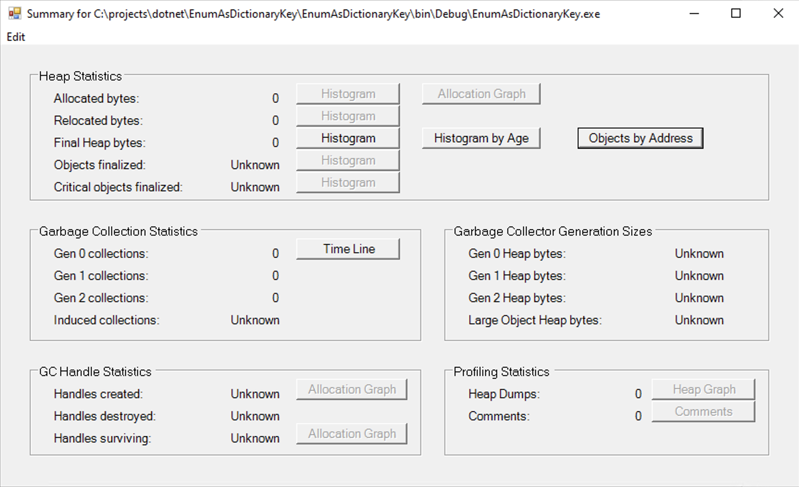
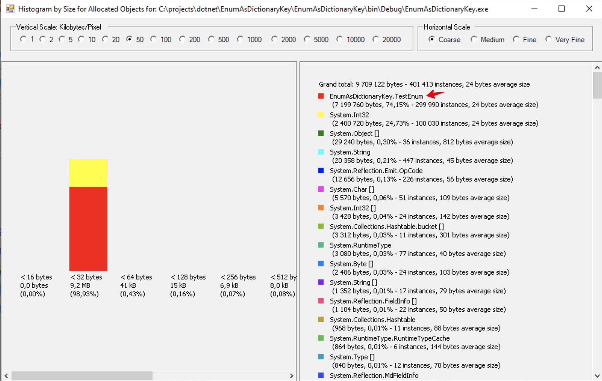
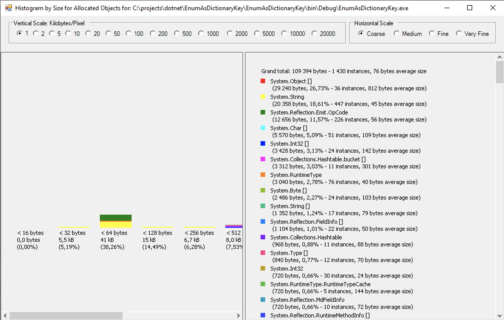

Однажды в 2016 году мне в проекте попался примерно такой код:
```c#
public sealed class EnumComparer<TEnum> : IEqualityComparer<TEnum>
    where TEnum : struct, IComparable, IConvertible, IFormattable
{
    private static readonly Func<TEnum, TEnum, bool> equals;
    private static readonly Func<TEnum, int> getHashCode;

    public static readonly EnumComparer<TEnum> Instance;

    static EnumComparer()
    {
        getHashCode = generateGetHashCode();
        equals = generateEquals();
        Instance = new EnumComparer<TEnum>();
    }

    private EnumComparer()
    {
        assertTypeIsEnum();
        assertUnderlyingTypeIsSupported();
    }

    public bool Equals(TEnum x, TEnum y)
    {
        return equals(x, y);
    }

    public int GetHashCode(TEnum obj)
    {
        return getHashCode(obj);
    }

    private static void assertTypeIsEnum()
    {
        if (typeof(TEnum).IsEnum)
            return;
        var message = $"The type parameter {typeof(TEnum)} is not an Enum. LcgEnumComparer supports Enums only.";
        throw new NotSupportedException(message);
    }

    private static void assertUnderlyingTypeIsSupported()
    {
        var underlyingType = Enum.GetUnderlyingType(typeof(TEnum));
        ICollection<Type> supportedTypes = new[]
        {
            typeof(byte), typeof(sbyte), typeof(short), typeof(ushort),
            typeof(int), typeof(uint), typeof(long), typeof(ulong)
        };
        if (supportedTypes.Contains(underlyingType))
            return;
        var message = $"The underlying type of the type parameter {typeof(TEnum)} is {underlyingType}. " +
                      "LcgEnumComparer only supports Enums with underlying type of " +
                      "byte, sbyte, short, ushort, int, uint, long, or ulong.";
        throw new NotSupportedException(message);
    }

    private static Func<TEnum, TEnum, bool> generateEquals()
    {
        var xParam = Expression.Parameter(typeof(TEnum), "x");
        var yParam = Expression.Parameter(typeof(TEnum), "y");
        var equalExpression = Expression.Equal(xParam, yParam);
        return Expression.Lambda<Func<TEnum, TEnum, bool>>(equalExpression, new[] {xParam, yParam}).Compile();
    }

    private static Func<TEnum, int> generateGetHashCode()
    {
        var objParam = Expression.Parameter(typeof(TEnum), "obj");
        var underlyingType = Enum.GetUnderlyingType(typeof(TEnum));
        var convertExpression = Expression.Convert(objParam, underlyingType);
        var getHashCodeMethod = underlyingType.GetMethod("GetHashCode");
        var getHashCodeExpression = Expression.Call(convertExpression, getHashCodeMethod);
        return Expression.Lambda<Func<TEnum, int>>(getHashCodeExpression, new[] {objParam}).Compile();
    }
}
```
и его использования
```c#
public enum TestEnum 
{
    One,
    Two
}
...
    var dict = new Dictionary<TestEnum, int>(EnumComparer<TestEnum>.Instance);
```
Я удивился и поспрашивал у коллег, что это. Пару раз меня перенаправили в духе «Спроси у Пети, он должен знать»,
но в итоге подсказали, что это оптимизирует аллокацию памяти, и есть статья в интернетах с описанием детали.

Порыскав, я нашёл https://ayende.com/blog/3885/dictionary-enum-t-puzzler, содержащую ссылку на другую
[статью](https://www.codeproject.com/Articles/33528/Accelerating-Enum-Based-Dictionaries-with-Generic), 
откуда код и был скопирован. Замечу, что статьи от 2009 года.
А в проекте у нас использовался Rhino.Mocks за авторством того же Ayende Rahien.
Видимо, кто-то читал его блог и решил втащить оптимизацию.

Примерно в то же время, я осваивал азы профилирования мемори-трафика с помощью 
[CLRProfiler](https://github.com/microsoftarchive/clrprofiler/blob/fall_2012/Wiki/CLRProfiler.md).
Тогда он ещё не был перенесён в архив для истории и жил на сайте Microsoft.

Испытуемый код:
```c#
    public static void Main()
    {
        var dict = new Dictionary<TestEnum, int>(); // #1
        // var dict = new Dictionary<TestEnum, int>(EnumComparer<TestEnum>.Instance); //  #2

        for (int i = 0; i < 100000; i++)
        {
            var x = (TestEnum) (i % 10);
            dict[x] = 100000 - (int) x;
        }

        foreach (var kvp in dict)
        {
            Console.WriteLine($"{kvp.Key}: {kvp.Value}");
        }

        Console.ReadLine();
    }
```
Гипотеза, что вариант #1 должен создавать большой мемори-трафик, а #2 маленький.

Вооружившись CLRProfiler, начал профилировать и, каково же было моё удивление, когда он показал нулевой мемори-трафик:



Хотел бы закрутить интригу, но перейду сразу к развязке – дело в используемом фреймворке.

Если переключить на `<TargetFrameworkVersion>v3.5</TargetFrameworkVersion>`, 
то действительно #1 аллоцирует как не в себя:


а #2 более-менее:


Но, `<TargetFrameworkVersion>v4.0</TargetFrameworkVersion>` и выше – уже нет.

[Исходные коды](https://referencesource.microsoft.com/#mscorlib/system/collections/generic/equalitycomparer.cs,61)
показывают, что в 4.0 ребята из Microsoft поправили дефолтный компаратор.

Далее я создал тикет «Попилить кастомный EnumComparer», в котором описал результаты своего исследования, 
попилил использования и организовал встречу разработчиков, где рассказал всю историю целиком.

Выводы:
1. Когда втаскиваешь советы из интернета, было бы неплохо убедиться, что они применимы
   (ибо сдаётся мне, что в нашем проекте пользы от кастомного компаратора не было никогда 
   – начинали после выхода четвёртого фреймворка)
2. Надо документировать, что и зачем ты делаешь, когда вносишь хак (смотри метафору про жгут в прекрасном докладе
   [Перформанс: что в имени тебе моём](https://jug.ru/talks/joker-2016/performance-whats-in-it-for-you/))