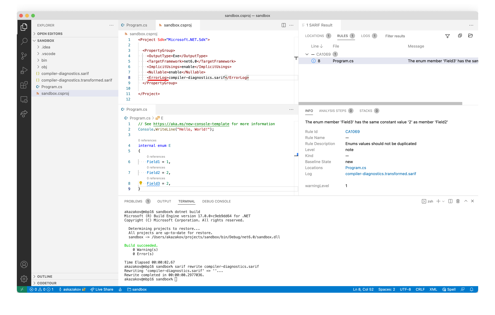

## How to

When you run `dotnet build` you get only errors and warnings in output. What if you like to see info level messages too?

You can try
- add `<ErrorLog>compiler-diagnostics.sarif</ErrorLog>` to .csproj file
- build your app
- install Sarif.Multitool
```
dotnet tool install --global Sarif.Multitool
```
- conver compiler-diagnostics.sarif via 
```
sarif rewrite compiler-diagnostics.sarif
```
- use [plugin](https://marketplace.visualstudio.com/items?itemName=MS-SarifVSCode.sarif-viewer) for Visual studio code
(dotnet build produces sarif file with version 1.0.0 but vscode plugin supports only 2.1.0 – that's why we have converted file on previous step) 

Example
```
mkdir sandbox && cd "$_"
dotnet new console
```
add 
```csharp
internal enum E
{
    Field1 = 1,
    Field2 = 2,
    Field3 = 2,
}
```
to Program.cs

(Don't forget about `ErrorLog`)


